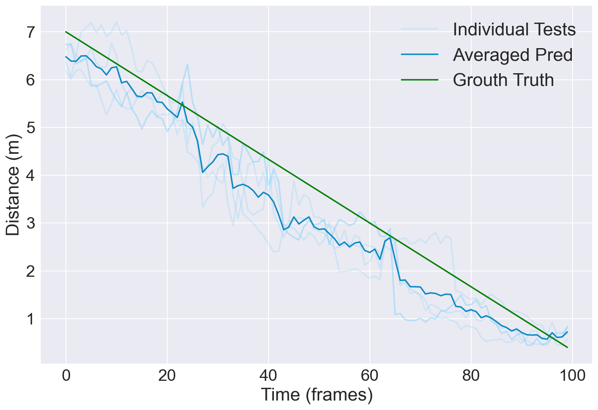

# Active Crowd Analysis: Pandemic Risk Mitigation for the Blind or Visually Impaired

## Result Reproduction Instructions

First setup a Python3 virtual environment with `conda`.

## Setup

```shell script
$ conda env create -n active_crowd -f=requirements/mobilnet_ssd.yml
$ conda activate active_crowd
```

## Demonstration Run

For images inside the `SSD_active_crowd_analysis/demo` folder

    $ cd SSD_active_crowd_analysis
    $ python demo_img_seq --config-file --config-file configs/mobilenet_v2_ssd320_voc0712.yaml --ckpt SSD_active_crowd_analysis/outputs/mobilenet_v2_ssd320_voc0712/mobilenet_v2_ssd320_voc0712_v2.pth

For a real-time video human detection and distance regression

    $ cd SSD_active_crowd_analysis
    $ python demo_scene_crowd_video --config-file --config-file configs/mobilenet_v2_ssd320_voc0712.yaml --ckpt SSD_active_crowd_analysis/outputs/mobilenet_v2_ssd320_voc0712/mobilenet_v2_ssd320_voc0712_v2.pth

## Object Detection and Localization

### Dataset Download

Download the PASCAL VOC dataset by running the Jupyter Notebook script in
`SSD_active_crowd_analysis/datasets/download_voc_data.ipynb`

### Generating Metrics for our Model

To generate the mAP scores for the different classes in the PASCAL VOC dataset for our modified Mobilnet-V2

```shell script
$ cd SSD_active_crowd_analysis
$ python test.py --config-file --config-file configs/mobilenet_v2_ssd320_voc0712.yaml --ckpt SSD_active_crowd_analysis/outputs/mobilenet_v2_ssd320_voc0712/mobilenet_v2_ssd320_voc0712_v2.pth
```

### Generating Metrics for other Models

To generate the mAP scores for the different classes in the PASCAL VOC dataset for other models:

Download the check-pointed model weights first:

To download trained weights for different models:

-   VGG16 SSD300x300 `wget https://github.com/lufficc/SSD/releases/download/1.2/vgg_ssd300_voc0712.pth`
-   VGG16 SSD512x512 `wget https://github.com/lufficc/SSD/releases/download/1.2/vgg_ssd512_voc0712.pth`
-   EfficientNet-B3	300x300 `wget https://github.com/lufficc/SSD/releases/download/1.2/efficient_net_b3_ssd300_voc0712.pth`

And put the trained weight checkpoints inside the other SSD directory, `SSD/outputs/`

```shell script
$ cd SSD
$ python test.py --config-file --config-file configs/vgg_ssd300_voc0712.yaml --ckpt SSD/outputs/vgg_ssd300_voc0712.pth
```

## Distance Regression

### Dataset Download

We use the KITTI Vision Benchmark Data for 2D Object Detection at
<http://www.cvlibs.net/datasets/kitti/eval_object.php?obj_benchmark=2d>
for training our distance neural network

#### Download images (Optional)

```shell script
wget https://s3.eu-central-1.amazonaws.com/avg-kitti/data_object_image_2.zip
unzip data_object_image_2.zip
```

**Note:** Downloading images is optional since we only use the bounding box information from the labels

#### Download annotations (Optional)

```shell script
wget https://s3.eu-central-1.amazonaws.com/avg-kitti/data_object_label_2.zip
unzip data_object_label_2.zip
```

**Note:** Data has already been downloaded and stored in a single `SSD_active_crowd_analysis/distance_regressor/data/annotations.csv` file

#### Optional; Download link for video of person walking towards camera

<https://drive.google.com/drive/folders/1hxoNDtZJtkIaoN89uM8H4nrJdJIEQnWh?usp=sharing>

We use the video samples above to generate our distance regression vs ground truth graph below for a person walking
towards the camera from 7m to 0.4m on an average time of 10s for each video.



The distance values for each video or any custom video can be generated using: (**IMPORTANT NOTE** The `cv2.videocapture('PATH_to_video')` must be set to the video path inside `demo_scene_crowd_video.py` instead of `cv2.videocapture(0)`)

    $ cd SSD_active_crowd_analysis
    $ python demo_scene_crowd_video.py --config-file --config-file configs/mobilenet_v2_ssd320_voc0712.yaml

### Generating Metrics

All metrics can be generated independently by following the Jupyter Notebook `distance_regressor_example.ipynb`

## Multiple Object Tracking Evaluation

### Dataset Download

-   Download the MOT16 object tracking data and labels from the MOT-16 official website.
    <https://motchallenge.net/data/MOT16/>.
-   Unzip the training and label files.
-   Only the data subset `MOT16/train/MOT16-02` is required and tested in our repository.
-   The image source path `SSD_active_crowd_analysis/datasets/MOT16/train/MOT16-02/img1` must be created.
-   Run `python generate_multi_person_tracking_predictions --config-file --config-file configs/mobilenet_v2_ssd320_voc0712.yaml`
    to generate the predictions which are saved in `py-motmetrics/motmetrics/data/MOT16/predicted/MOT16-02.txt`

**IMPORTANT Note** Only pedestrian class values from the ground truth file with visibility ratio of more than `0.7` are used and a score threshold of `0.65` is used for all classifiers. We use `py-motmetrics/motmetrics/data/drop_non_pedestrian_data.py` to do our filtering.

**Note** However, the filtered ground truth files are already present in `py-motmetrics/motmetrics/data/MOT16/gt`

### Generating Metrics

Image source path `datasets/MOT16/train/MOT16-02/img1` must be available.
The predicted `MOT16-02.txt` must be present in `py-motmetrics/motmetrics/data/MOT16/predicted/` by default.

```shell script
$ cd py-motmetrics
$ python -m motmetrics.apps.eval_motchallenge motmetrics/data/MOT16/gt motmetrics/data/MOT16/predicted/
```

For more information on running py-motmetrics, check `SSD_active_crowd_analysis/py-motmetrics/readme.md`

## Acknowledgements

The SSD code is derived from <https://github.com/lufficc/SSD> and the circlenet is derived from <https://github.com/NoodleHam/Circular-Bounding-Box-SSD>

-   py-motmetrics <https://github.com/cheind/py-motmetrics>
-   circlenet <https://github.com/NoodleHam/Circular-Bounding-Box-SSD>
-   SSD <https://github.com/lufficc/SSD>
-   pytorch SSD <https://github.com/amdegroot/ssd.pytorch>
